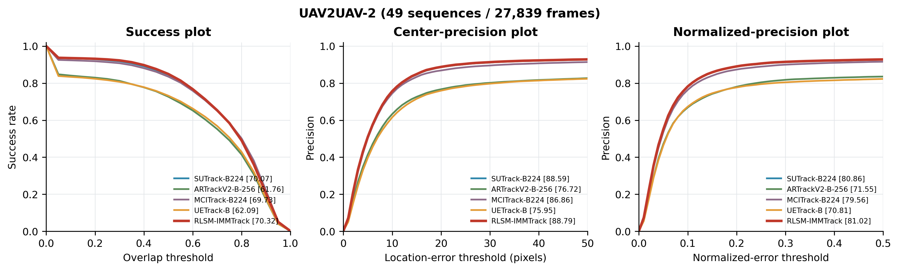
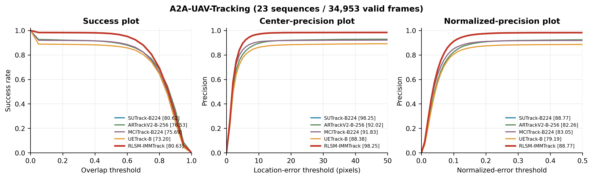

# RLSM-IMMTrack

An inference-time reliability layer for **UAV-to-UAV visual tracking**, built on SUTrack-B224. The UAV is the tracked target, not merely the camera platform.

RLSM-IMMTrack combines confidence-controlled IMM filtering, future-validated short-/long-term appearance memory, and an isolated speculative shadow trajectory. The shadow branch can replace the reported bounding box without writing its state back into the main tracker, IMM, or deep templates. No additional network training is required.

This release includes the runnable RLSM method, SafeCL-IMMTrack baseline, original SUTrack inference, two dataset adapters, unified OPE scoring, plotting, tests, and archived experiment summaries. **Datasets and model weights are not included.**

> Release candidate: the original-code license is awaiting the copyright holders' selection. Add a suitable LICENSE before public distribution. Third-party SUTrack files retain their MIT license; see [license status](LICENSE_STATUS.md) and [notices](THIRD_PARTY_NOTICES.md).

## Key results

All entries below are **our local re-evaluations**, not numbers copied from the original methods' papers or official leaderboard submissions. Values are percentages; higher is better for all columns shown. “UAV2UAV” denotes the 49-sequence **UAV2UAV-2** release used in the experiments.

### UAV2UAV — 49 sequences, 27,839 evaluated frames

| Method | Year | Success AUC | AO | SR@0.50 | SR@0.75 | P@10px | P@20px | Norm. precision AUC |
|---|---:|---:|---:|---:|---:|---:|---:|---:|
| ARTrackV2-B-256 | 2024 | 61.76 | 61.97 | 72.66 | 49.10 | 63.33 | 76.72 | 71.55 |
| MCITrack-B224 | 2025 | 69.73 | 70.56 | 83.51 | 58.60 | 74.47 | 86.86 | 79.56 |
| SUTrack-B224 | 2025 | 70.07 | 70.91 | 84.53 | 58.27 | 75.55 | 88.59 | 80.86 |
| UETrack-B | 2026 | 62.09 | 62.31 | 73.24 | 50.61 | 61.56 | 75.95 | 70.81 |
| SafeCL-IMMTrack | — | 70.19 | 71.04 | 84.74 | 58.39 | 75.77 | 88.78 | 81.01 |
| **RLSM-IMMTrack** | — | **70.32** | **71.16** | **84.96** | 58.44 | 75.69 | **88.79** | **81.02** |

The full-precision values and additional metrics are available in [benchmark_metrics.csv](results/benchmark_metrics.csv). RLSM improved success AUC by **0.242 percentage points over SUTrack** and **0.123 points over SafeCL** on this collection. This was a development/evaluation collection, not an independently held-out test; the small gains should be interpreted accordingly.

### A2A — 23 sequences, 35,256 frames, 34,953 valid evaluation frames

| Method | Year | Success AUC | AO | SR@0.50 | SR@0.75 | P@10px | P@20px | Norm. precision AUC |
|---|---:|---:|---:|---:|---:|---:|---:|---:|
| ARTrackV2-B-256 | 2024 | 76.53 | 77.68 | 90.46 | 76.89 | 89.52 | 92.02 | 82.26 |
| MCITrack-B224 | 2025 | 75.69 | 76.79 | 90.77 | 75.84 | 90.75 | 91.83 | 83.05 |
| SUTrack-B224 | 2025 | 80.62 | 82.10 | 97.46 | 80.68 | 97.03 | **98.25** | 88.77 |
| UETrack-B | 2026 | 73.20 | 74.08 | 87.49 | 74.45 | 86.20 | 88.38 | 79.19 |
| SafeCL-IMMTrack | — | 80.62 | 82.10 | 97.46 | 80.68 | 97.03 | **98.25** | 88.77 |
| **RLSM-IMMTrack** | — | **80.63** | **82.10** | **97.47** | **80.69** | **97.03** | **98.25** | **88.77** |

The same RLSM configuration was used without A2A-specific tuning. Its AUC difference from SUTrack is approximately **0.007 percentage points**: performance is effectively neutral, not evidence of a meaningful statistical improvement. Metrics are computed at the decoded image resolution, without rescaling predictions to a nominal source-video resolution.

See [per-sequence metrics](results/per_sequence_metrics.csv), [cross-dataset heatmaps](assets/cross_dataset_per_sequence_auc_heatmaps.png), and [result provenance](results/README.md). Other trackers' implementations and checkpoints are not bundled; their existing predictions were rescored with the same metrics.

## 1. Installation

### Tested inference environment

Python **3.9.25**, PyTorch **1.11.0+cu113**, torchvision **0.12.0+cu113**, CUDA runtime **11.3**, NVIDIA **GeForce GTX 1080 (8 GB)**. The package was smoke-tested on Windows. Linux commands are provided for convenience but were not independently tested in this release. Inference currently requires CUDA; metric computation works on CPU.

From the extracted repository root:

~~~bash
conda create -n rlsm-immtrack python=3.9 -y
conda activate rlsm-immtrack
python -m pip install "setuptools<81"
python -m pip install torch==1.11.0+cu113 torchvision==0.12.0+cu113 --extra-index-url https://download.pytorch.org/whl/cu113
python -m pip install -r requirements.txt
python -m rlsm_immtrack doctor
~~~

Use a compatible NVIDIA driver. These are deliberately conservative reproduction pins, not a claim of compatibility with every current GPU or PyTorch release. Recent GPUs may need a newer PyTorch/CUDA stack, which has not been validated here. The bundled SUTrack loader uses the original checkpoint-loading API; do not silently substitute PyTorch 2.6+ and assume identical behavior.

For **scoring/plotting only**, install Python 3.9 and:

~~~bash
python -m pip install -r requirements-metrics.txt
python -m rlsm_immtrack score --help
~~~

The inference subset of upstream SUTrack is already included under third_party/SUTrack; no clone, editable installation, training data, or local.py setup is necessary. Run commands from the repository root.

## 2. Model checkpoint

Obtain the **SUTrack-B224** final checkpoint, SUTRACK_ep0180.pth.tar, from the [official SUTrack model repository](https://huggingface.co/xche32/SUTrack/tree/main/checkpoints). Other model sizes are not interchangeable with this release.

Place it at:

~~~text
checkpoints/SUTRACK_ep0180.pth.tar
~~~

Reference file used in the experiments:

- Size: **1,291,057,340 bytes**
- SHA-256: **2db2e7105d133f8c75b113d189ed74286fba4d21f645df56c645c84eb3d856f1**

Verify on PowerShell:

~~~powershell
Get-FileHash checkpoints/SUTRACK_ep0180.pth.tar -Algorithm SHA256
~~~

Or on Linux:

~~~bash
sha256sum checkpoints/SUTRACK_ep0180.pth.tar
~~~

Only load trusted weights: legacy PyTorch checkpoint files may execute pickle code. The wrapper constructs CLIP's architecture locally and loads the complete final state dictionary with strict matching, so no separate CLIP/encoder pretraining download is required.

## 3. Datasets

Download datasets from their owners and comply with their terms:

- [UAV2UAV-2](https://github.com/zxysysu/UAV2UAV--2)
- [A2A-UAV-Tracking](https://github.com/KingArthurYu/A2A-UAV-Tracking)

Supported layouts:

~~~text
data/
  UAV2UAV-2/
    img/<sequence>/000001.jpg
    anno/<sequence>.txt
  A2ATracking/
    video01/img/000001.jpg
    video01/groundtruth.txt
    ...
    video23/img/...
    video23/groundtruth.txt
~~~

Images are naturally sorted. Annotations accept comma, space, tab, or semicolon-separated xywh boxes; 8-coordinate polygons are converted to axis-aligned boxes. groundtruth_rect.txt is also supported. Keep coordinates in the same pixel system as the decoded images. The first annotation must be a valid initialization box.

Validate before a long run:

~~~bash
python -m rlsm_immtrack validate --dataset-root data/UAV2UAV-2 --alignment common --output runs/uav_validation.json
python -m rlsm_immtrack validate --dataset-root data/A2ATracking --decode --output runs/a2a_validation.json
~~~

By default, mismatched image/annotation counts cause an error. The archived UAV2UAV extraction contains count mismatches; **--alignment common** reproduces the original evaluator's explicit truncation to min(images, annotations). Inspect the validation report before accepting this. It does not repair a missing middle frame or an incorrect frame-to-annotation correspondence. With --decode every selected image is decoded; without it, validation checks structure, annotations and file counts, not image content integrity.

## 4. Run tracking

### Quick GPU smoke test

~~~bash
python -m rlsm_immtrack evaluate --tracker rlsm --dataset-root data/UAV2UAV-2 --checkpoint checkpoints/SUTRACK_ep0180.pth.tar --sequences test4_DJI_0101_3 --max-frames 50 --output runs/smoke
~~~

This is only a short prefix test, not a benchmark result.

### Full benchmarks

~~~bash
python -m rlsm_immtrack evaluate --tracker rlsm --dataset-root data/UAV2UAV-2 --alignment common --checkpoint checkpoints/SUTRACK_ep0180.pth.tar --config configs/paper.json --output runs/uav_rlsm
python -m rlsm_immtrack evaluate --tracker rlsm --dataset-root data/A2ATracking --checkpoint checkpoints/SUTRACK_ep0180.pth.tar --config configs/paper.json --output runs/a2a_rlsm
~~~

**All sequences and all aligned frames are evaluated by default.** There is no hidden five-sequence default. Use --sequences and --max-frames only for debugging or explicitly declared subset experiments.

For the baselines, run the same command with --tracker sutrack or --tracker safecl and a **different output directory**. --device 0 selects a CUDA device. The paper configuration keeps the inherited camera-motion and re-detection interfaces enabled; it does not silently implement the earlier no-camera/no-redetection variant. Change those JSON flags only for explicitly labeled ablations.

### Outputs and interruption recovery

~~~text
runs/uav_rlsm/
  manifest.json
  predictions/<sequence>.csv
  diagnostics/<sequence>.csv
  completed/<sequence>.json
  metrics.json
  per_sequence.csv
~~~

Predictions contain one x,y,w,h row per tracked frame, preceded by a header; the first row is the initialization box. Diagnostics expose quality, model probabilities, memory commits, shadow decisions and timing. The original SUTrack baseline has fewer internal diagnostic fields.

To resume, repeat the **same command** with --resume. Completed sequences are skipped only after output hash verification. An interrupted sequence is restarted from its first frame; hidden filter/template states are not serialized mid-sequence. A run manifest guards against mixing different parameters, code, checkpoint, runtime, frame limits or dataset inventories. Nonempty output directories are otherwise protected against replacement.

The image inventory fingerprint records names and sizes, not every image's content hash. Keep input files immutable during experiments.

## 5. Re-score and plot

Existing predictions can be evaluated without model weights or a GPU:

~~~bash
python -m rlsm_immtrack score --dataset-root data/UAV2UAV-2 --alignment common --predictions runs/uav_rlsm/predictions --output runs/uav_rlsm_rescored
python -m rlsm_immtrack plot --metrics runs/uav_sutrack/metrics.json runs/uav_safecl/metrics.json runs/uav_rlsm/metrics.json --labels SUTrack SafeCL RLSM --output runs/uav_curves.png
~~~

External predictions must use one comma-separated xywh file per sequence, with either no header or x,y,w,h / x,y,width,height. Explicitly named trailing diagnostic columns (such as tracker_seconds) are ignored; headerless files must have exactly four columns. Missing or extra rows cause an error. For debug prefixes, specify the same --sequences and --max-frames when scoring.

Comparison plots require matching datasets, sequences and frame counts; mixed full/subset results are rejected.

Protocol details:

- Causal one-pass evaluation: first-frame GT initialization, no reset, no subsequent GT fed to the tracker.
- Aggregate metrics pool valid frames across sequences; they are **not** unweighted sequence means.
- Success AUC: mean of 21 success rates at IoU thresholds 0:0.05:1, using IoU >= threshold. This discrete AUC differs from AO and gives a zero-IoU frame a 1/21 success-AUC contribution.
- AO: mean IoU; SR@0.50 and SR@0.75: corresponding overlap success rates.
- Center precision: fraction with Euclidean center error <= 10 or 20 pixels.
- Normalized precision AUC: average of 51 rates over thresholds 0:0.01:0.5; x/y center residuals are divided by GT width/height.
- Low-overlap rate: fraction with IoU < 0.10. Mean, median, and RMSE center errors are also saved.
- Nonfinite or nonpositive-size GT boxes are excluded from scoring, but the tracker still processes those frames. This excludes 303 A2A frames in the archived evaluation.
- New FPS is measured over CUDA-synchronized complete track() calls, excluding image I/O, model loading and initialization. Initialization time is reported separately. Historical FPS fields used different instrumentation and should not be treated as directly comparable to this new timing field.

## 6. Code map and method

| File | Role |
|---|---|
| rlsm_immtrack/imm.py | Three-mode eight-state IMM; center, velocity, log size and log-size velocity |
| rlsm_immtrack/safecl.py | Confidence-dependent measurement noise, IMM-guided search, safe baseline recursion |
| rlsm_immtrack/tracker.py | Future-validated dual appearance memory; causal shadow prediction, takeover and rollback |
| rlsm_immtrack/sutrack.py | Portable loader for the pinned SUTrack-B224 checkpoint |
| rlsm_immtrack/data.py | UAV2UAV/A2A adapters and image/annotation loading |
| rlsm_immtrack/metrics.py | The original OPE metric definitions |
| rlsm_immtrack/experiment.py | Dataset checks, run manifests, inference loop, scoring and timing |
| configs/paper.json | Frozen run configuration |

The short-term bank follows recent appearance; the long-term bank protects a stable reference. A proposed write is admitted only after subsequent supportive observations. A separate shadow trajectory is compared against the safe branch using visual, appearance and motion evidence. Consecutive wins activate output takeover; rollback gates revoke it. Memory observations use the safe branch, and speculative output never overwrites the safe recursion.

The IMM covariance and confidence-to-noise mapping are heuristic in this implementation; they are not a claim of statistically calibrated uncertainty. Algorithm constants were retained for faithful reproduction, not retuned during packaging. See [configuration notes](docs/CONFIGURATION.md) for exposed parameters.

## 7. Tests and reproducibility

~~~bash
python -m unittest discover -s tests -v
~~~

The full test suite needs the inference dependencies but does not require a GPU. For a NumPy-only metric check:

~~~bash
python -m unittest discover -s tests -p test_metrics.py -v
~~~

See [release validation](docs/VALIDATION.md) for the actual checks performed, GPU smoke comparisons and remaining validation scope. The tracking/math definitions were checked against the experimental implementation at Python AST level. Small floating-point differences across CUDA kernels/devices may still occur; cuDNN benchmarking follows the original experiment settings.

## Citation and acknowledgments

Please cite the underlying [SUTrack paper](https://ojs.aaai.org/index.php/AAAI/article/view/32223) and the dataset papers when using this code or these datasets. SUTrack was published at AAAI 2025:

~~~bibtex
@inproceedings{chen2025sutrack,
  title={SUTrack: Towards Simple and Unified Single Object Tracking},
  author={Chen, Xin and Kang, Ben and Geng, Wanting and Zhu, Jiawen and Liu, Yi
          and Wang, Dong and Lu, Huchuan},
  booktitle={Proceedings of the AAAI Conference on Artificial Intelligence},
  year={2025}
}
~~~

RLSM-IMMTrack manuscript metadata should be added by the authors when finalized; this release does not invent a publication venue, DOI, author list or acceptance status.
